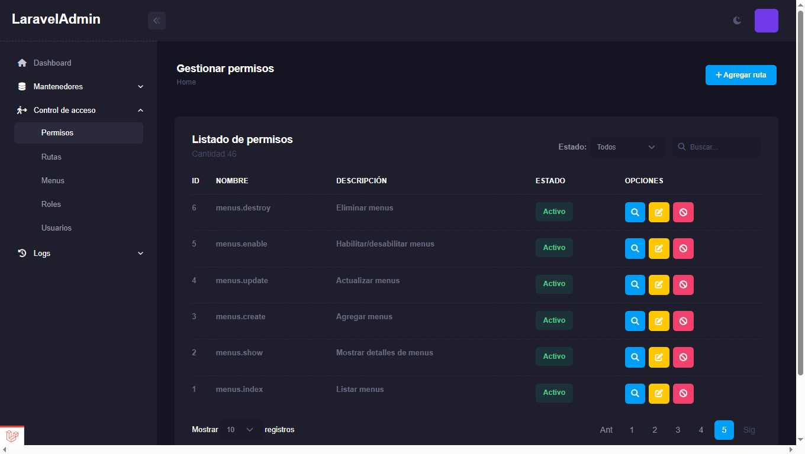

# 1 composer dump-autoload
# 2 migrate datebase
# php artisan migrate 
# php artisan db:seed

# migrate datebase testing: php artisan migrate --env=testing
# ejecutar un test: 
## php artisan test --filter=UserManagementTest
## php artisan test --filter=UserManagementTest --coverage-html=reports